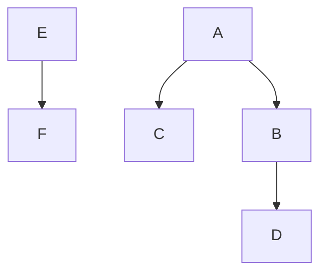
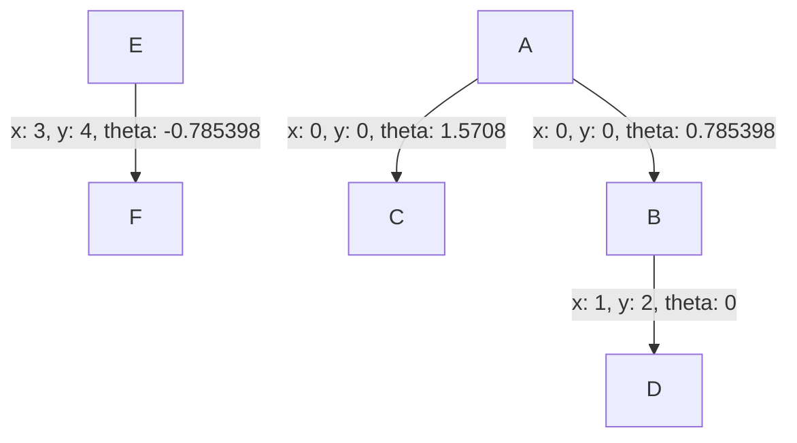
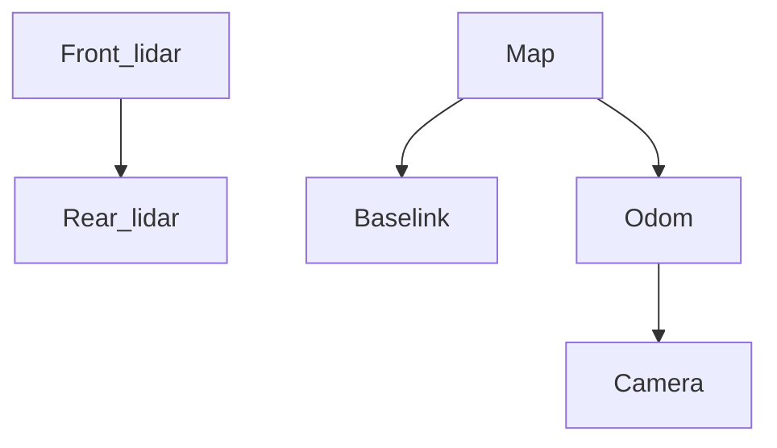

# TransformsGraph
A C++ directed-acyclic graph data structure to hold transforms between reference frames.

This is similar to the [tf2 ROS package](http://wiki.ros.org/tf2), but this package is ROS agnostic and is less complex.

# Contents

<!-- vim-markdown-toc GFM -->

* [Requirements](#requirements)
* [Usage](#usage)
    * [Required types](#required-types)
    * [Maximum number of frames](#maximum-number-of-frames)
    * [Using `enum` for `Frame`](#using-enum-for-frame)
* [Transforms storage](#transforms-storage)
    * [Mermaid graphs](#mermaid-graphs)
* [Installation](#installation)
* [FAQ](#faq)

<!-- vim-markdown-toc -->

# Requirements
The library runs on C++11 and doesn't require external dependencies.
However, some of the examples require additional dependencies:
- Eigen 3.3 (optional)
- [Sophus](https://github.com/strasdat/Sophus), version `1.22.10` (optional)

# Usage
Some high-level documentation is provided in this section.
Refer to [`transforms_graph.h`](include/transforms_graph/transforms_graph.h) for further documentation.

## Required types
The `TransformsGraph` requires two template parameters:
1. `Transform` type. This is the type that stores the transforms themselves (i.e., poses). This type should have the following defined:
    - A default constructor that sets the transform to the identity transform
    - A valid Multiplication operator `*` operator (i.e., `T1 = T2 * T2`)
    - A valid `Transform inverse() const` method (i.e., `T1.inverse() * T1` should return an identity transform)
    - An output stream operator `<<` (i.e., `std::cout << T`)
2. `Frame` type (default set to `char`). This is the type that keeps track of the frames. The type should have the following defined:
    - Greater-than comparison operator `>` (i.e., `frame_i > frame_j`)
    - An output stream operator `<<` (i.e., `std::cout << T`)

The classes from [Sophus](https://github.com/strasdat/Sophus) (e.g., `Sophus::SE2d`) and [Eigen](https://eigen.tuxfamily.org/dox/group__TutorialGeometry.html) (e.g., `Eigen::Affine2d`) already satisfy the `Transform` requirements, except for the output stream operator `<<` requirement.

Refer to the examples folder for examples of the `Transform` and `Frame` types.

## Maximum number of frames
The `TransformsGraph` requires the maximum number of frames expected to be in the object.
The default is set to `100`.

## Using `enum` for `Frame`
The `Frame` type can take many built-in types without the need for any modification (e.g., `char`, `int`, `size_t`).
However, using `enum` or `enum class` is a good idea since the user would get compile-time errors when trying to add or retrieve transforms or frames with "unknown" or undefined frames.

Here's an example of using the `enum class` for `Frame`:
```c++
enum class Frame { MAP, ODOM, BASE_LINK, CAMERA, FRONT_LIDAR };
std::ostream& operator<<(std::ostream& os, const Frame& frame) {
  return os << static_cast<int>(frame);
}

int main() {
  tg::TransformsGraph<Pose, Frame> transforms;
  transforms.AddTransform(Frame::MAP, Frame::ODOM, Pose({1, 2}, 0.0));
  transforms.AddTransform(Frame::BASE_LINK, Frame::CAMERA, Pose({0.5, 0.0}, 0.0));
  transforms.AddTransform(Frame::BASE_LINK, Frame::FRONT_LIDAR, Pose({2, 1}, M_PI_4));
}
```

# Transforms storage
The transforms are stored in the transform graph in a specific way to ensure uniqueness.
Specifically, the transform is stored as `T_a_b`, where `a` is smaller than `b`.

This has a minor side effect that the transform could be stored in a way that's different than what the user provided.
For example, if the user does
```c++
tg::TransformsGraph<Transform> transforms;
transforms.AddTransform('b', 'a', Transform(M_PI_4, {0, 0}));
```
Then, since `'b' > 'a'`, then the transform is inverted and is stored as `T_a_b = Transform(M_PI_4, {0, 0}).inverse()`.
When the user asks for the transform `T_b_a`, then the transform is computed using `T_b_a = T_a_b.inverse()` and is returned to the user.

From the user side, everything looks normal, but there are some side effects to this design decision, and some possible remedies:
- Expensive inverse operation: if the user provides the transform `T_b_a` and keeps asking for `T_b_a`, then `T_a_b.inverse()` gets called in the background. This can be worrisome if the `inverse()` method is expensive.
- Possibly confusing graph visualization: The user may store `T_b_a`, which will be stored as `T_a_b`, and thus visualized as `T_a_b` when using the [mermaid graphs](#mermaid-graphs). This may lead to some confusions.

## Mermaid graphs
The library is equipped with a function that outputs [Mermaid graphs](https://mermaid.js.org/) that can be visualized [online](https://mermaid-js.github.io/mermaid-live-editor/) or in Markdown files by inserting them in a code block with `mermaid`  language identifier.

Note that the graph visualizes the *stored* graph, which may be slightly different from how the user constructed the graph.
Check the [Transforms storage](#transforms-storage) for additional details on this.

Taking the output from the [Sophus example](examples/sophus_pose_example.cpp) example
```c++
transforms.AddTransform(Frame::A, Frame::B, Transform(M_PI_4, {0, 0}));
transforms.AddTransform(Frame::A, Frame::C, Transform(M_PI_2, {0, 0}));
transforms.AddTransform(Frame::B, Frame::D, Transform(0, {1, 2}));
transforms.AddTransform(Frame::E, Frame::F, Transform(-M_PI_4, {3, 4}));
std::cout << transforms.GetMermaidGraph() << std::endl;
```
and wrapping it in a Markdown code block with `mermaid` language identifier, results in the following flowchart.



By default, the edges will not be shown.
However, the edges (i.e., the transforms) can be shown by passing `true` to `GetMermaidGraph`.
The output would look like the following.


Furthermore, the `GetMermaidGraph` function takes a unary function that takes a frame and returns a string.
This function can be used to override the frame names in the graph.
For example,
```C++
std::unordered_map<Frame, std::string> frame_names = {{Frame::MAP, "Map"},
                                                        {Frame::ODOM, "Odom"},
                                                        {Frame::BASE_LINK, "Baselink"},
                                                        {Frame::CAMERA, "Camera"},
                                                        {Frame::FRONT_LIDAR, "Front_lidar"}};
const auto get_frame_names = [&frame_names](Frame frame) { return frame_names[frame]; };
std::cout << transforms.GetMermaidGraph(get_frame_names) << std::endl;
```
results in


The transforms can be visualized for this option as well by passing `true` as the second argument to `GetMermaidGraph`.

# Installation
This is a header-only library.
It can be used by directly including the `include/transforms_graph/transforms_graph.h` into your folder, or it can be installed on your system by running the following from the root of this repo.
```bash
cmake -S . --build build
cmake --build build
sudo cmake --install build
```

# FAQ
- Why use a graph instead of a tree or a forest?
    - If the user decides to add a transform between the leaves of two disconnected trees, then one of the trees would need to be inverted to keep the data structure a tree. However, keeping the data structure as a graph avoids this hassle.
- Why using a [directed acyclic graph (DAG)](https://en.wikipedia.org/wiki/Directed_acyclic_graph)?
    - Getting transforms between two non-adjacent frames requires chaining multiple transforms. Thus, if the data structure allows for cycles, then suddenly there are multiple ways to get a transform. That is, the system is *overdetermined*. To avoid having such data structure, a directed acyclic graph will do the trick, since it avoids having redundant paths.
- What are the differences with the [tf2 ROS package](http://wiki.ros.org/tf2), and when should you use one over the other?
    - Compared to `tf2`, this package is ROS and Catkin agnostic
    - The `TransformsGraph` is a simple data structure and it doesn't do any processing on the frame such as interpolation, extrapolation, etc.
    - The `TransformsGraph` is time-invariant, and doesn't natively hold timestamps. The user can choose to include timestamps in the passed `Transform` object, but it's up to the user to manage the timestamps.

